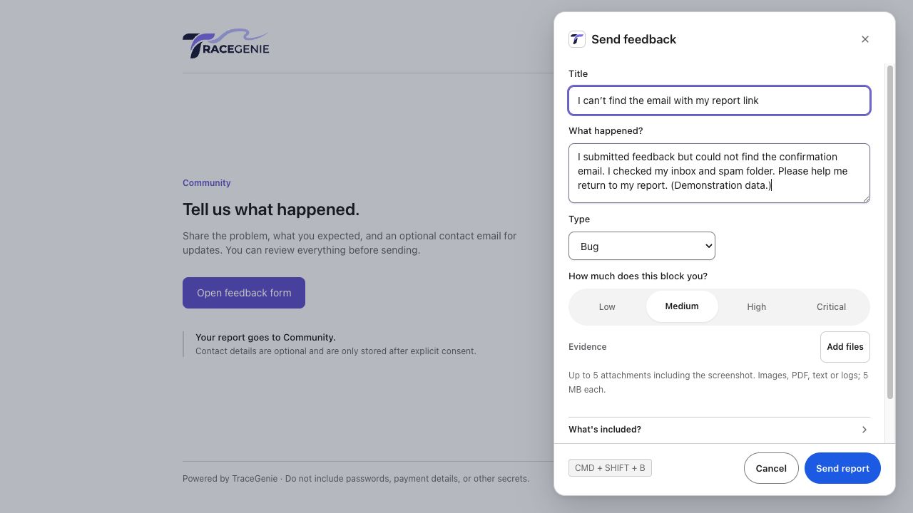
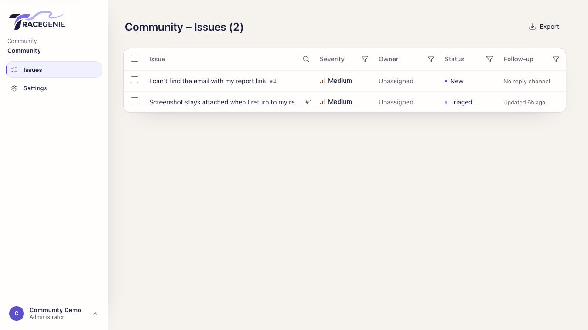
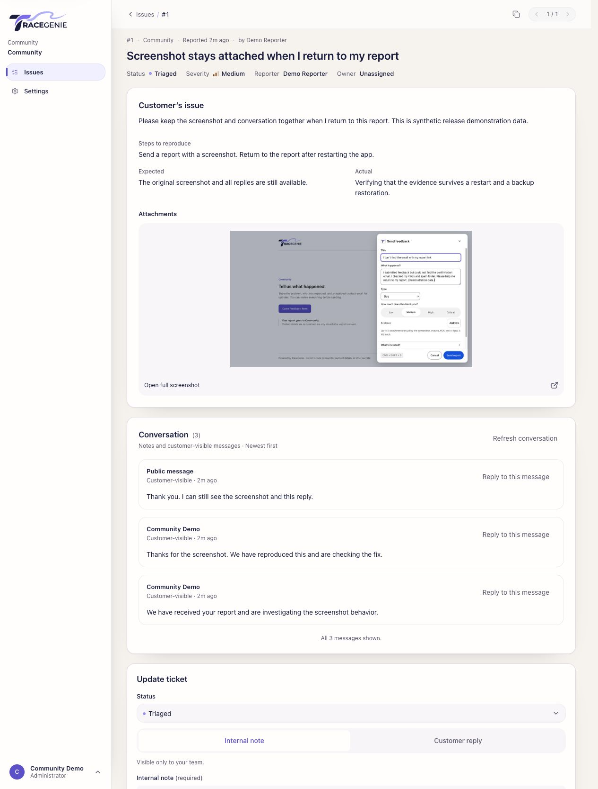

<div align="center">
  
  <h1>Your users found the bug. Give them a way to show you.</h1>
  <p><strong>Self-hosted bug reporting, screenshots, and conversations for the apps you ship.</strong></p>
  <p><a href="#get-started">Get started</a> · <a href="docs/SELF_HOSTING.md">Self-hosting</a> · <a href="docs/EMAIL.md">Email setup</a> · <a href="CONTRIBUTING.md">Contribute</a></p>
</div>

TraceGenie Community puts a report button inside your app. Users explain what went wrong, attach a screenshot, and send useful context straight to your issue inbox. You triage it, ask a follow-up question, and let them know when it is fixed.

**One project. Your server. A complete path from “this feels broken” to resolved.**



*Actual Community screens with synthetic demonstration data.*

## Built fast? Make feedback part of the app.

AI can help you ship a feature before lunch. It cannot tell you that a real user expected the total to update, could not find the next button, or saw a layout break on their phone.

If you vibe code, the next prompt is only as useful as the evidence you give it. “Checkout is broken” starts a guessing game. A screenshot, the page URL, what the user expected, and the browser context give you a concrete problem to investigate.

TraceGenie helps you collect that evidence and keep the conversation attached to the issue. Review and share the relevant, redacted details with your coding assistant, reproduce the problem, fix it, and close the loop with the reporter. Community does not automatically send reports to an AI provider or generate fixes.

> **Example:** “I changed the quantity from 1 to 3, but the total stayed the same.”
> That can be a real bug even when no exception is thrown. Let the person who noticed it show you.

## From report to resolution

| Step | What you get |
| --- | --- |
| **Capture** | An embedded widget or hosted feedback form; screenshots with a privacy editor and attachments. |
| **Understand** | The user's description, page and browser context, plus the evidence sources enabled for your project. |
| **Triage** | A searchable issue list with filters, severity, ownership, status history, comments, and duplicate marking. |
| **Reply** | A secure reporter page and replies attached to the original report. |
| **Resolve** | Track the fix and keep the person who reported it informed. |



## Where it fits alongside Sentry and PostHog

These products overlap. Choose the workflow you need; you may already have enough in your existing stack.

| Tool | A useful starting point when you need… |
| --- | --- |
| **TraceGenie Community** | A focused, self-hosted workflow for a user-reported issue: capture evidence, triage it, talk to the reporter, and resolve it. |
| **Sentry** | Application errors and debugging context. It also has a [user feedback widget](https://sentry.io/changelog/user-feedback-widget-is-now-ga/) that accepts user-initiated reports. |
| **PostHog** | Product analytics, replay, [surveys and qualitative feedback](https://posthog.com/docs/surveys), and [error tracking](https://posthog.com/docs/error-tracking) in a broader product platform. |

TraceGenie's reason to exist is the focused reporting and follow-up experience. It is not a replacement for application monitoring or product analytics, and user-initiated feedback is not exclusive to TraceGenie.

## Get started

### Self-host the app

You need **Docker with Compose v2** and a Bash terminal. Linux, macOS, and Windows with WSL2 are supported host environments; use the release asset matching your Docker CPU architecture.

1. Download the installer archive and its `.sha256` file from [Releases](https://github.com/Vertaware/tracegenie-community/releases).
2. Verify the checksum, extract the archive, and open its directory.
3. Run:

```sh
./tracegenie install
```

Open **http://localhost:8088**, enter the private setup code printed in your terminal, and create your administrator account and project. No Node installation or external database account is needed. The archive includes the application and supporting container images.

For a public HTTPS address, backup/restore, upgrades, architecture details, and checksum commands, see the [self-hosting guide](docs/SELF_HOSTING.md).

### Develop from source

Install **Node 24** and **Docker**, then:

```sh
git clone https://github.com/Vertaware/tracegenie-community.git
cd tracegenie-community
npm ci
npm run dev
```

Open **http://127.0.0.1:4311**. Your generated local login is in `.local/login.txt`; development mail is caught at **http://127.0.0.1:14325**. Setup creates a local PostgreSQL database, applies migrations, and starts the API, worker, consumer app, and widget preview.

`npm run stop` stops the development installation and preserves its data. [Contributing](CONTRIBUTING.md) explains the tests and workspace layout.

## Put it in your app

Open **Settings → Installation** and follow the frontend and backend snippets for your project. Add your website's exact origin and keep the project secret on your server. The widget uses a short-lived session token supplied by your backend; a static site needs a small serverless endpoint.

Want to collect feedback before embedding the widget? Share your hosted form:

```text
https://your-feedback-domain/feedback/?projectKey=community&mode=feedback
```

The JavaScript bundle is served from your installation at `/widget/embed.js`. The installation guide provides the actual snippet and configuration for your deployment.

<details>
<summary>See the issue detail and conversation</summary>



</details>

## Configure email in Settings

Open **Settings → Email**, choose **Resend**, enter your own API key and verified sender address, and select **Save and send test email**. Other SMTP providers are supported too. Credentials are encrypted on the server and are never returned to the widget.

Email enables notifications, password recovery, and reporter access codes. You can capture reports before configuring it. See [email configuration](docs/EMAIL.md) for provider setup, environment fallbacks, and backing up the encryption key.

## What Community includes

- One project per installation, the consumer app, hosted reporter pages, and the widget.
- PostgreSQL, local attachment storage, and an email worker with queued retries.
- Your own hosting and email provider, with Docker installation, backups, restores, and upgrades.
- The existing TraceGenie components and [motion design system](docs/MOTION_SYSTEM.md).

Community does not include multi-project SaaS management, billing, external ticket integrations, surveys, or an AI/MCP service. See [release notes](docs/RELEASE_NOTES.md) for the first release's verification and limits.

## Contribute

Bug reports, reproducible examples, documentation improvements, and focused pull requests are welcome. Read [Contributing](CONTRIBUTING.md), use [Issues](https://github.com/Vertaware/tracegenie-community/issues), and avoid including credentials or private customer reports.

CI runs repository hygiene, type checking, the supported regression suite, and production builds. Release automation builds and exercises the packaged installation before attaching downloadable archives to a release.

## License

[GNU Affero General Public License v3.0 only (AGPL-3.0-only)](LICENSE).

Community is free to use, **including commercially**, when you comply with the AGPL. Source-sharing requirements apply to covered distributions and modified versions used over a network. Embedding the widget may have implications for a combined application; read [Licensing](docs/LICENSING.md) before choosing how to integrate it.

For enquiries about alternative commercial terms, visit [traceitgenie.com](https://traceitgenie.com). Third-party packages retain their own licences and notices.
